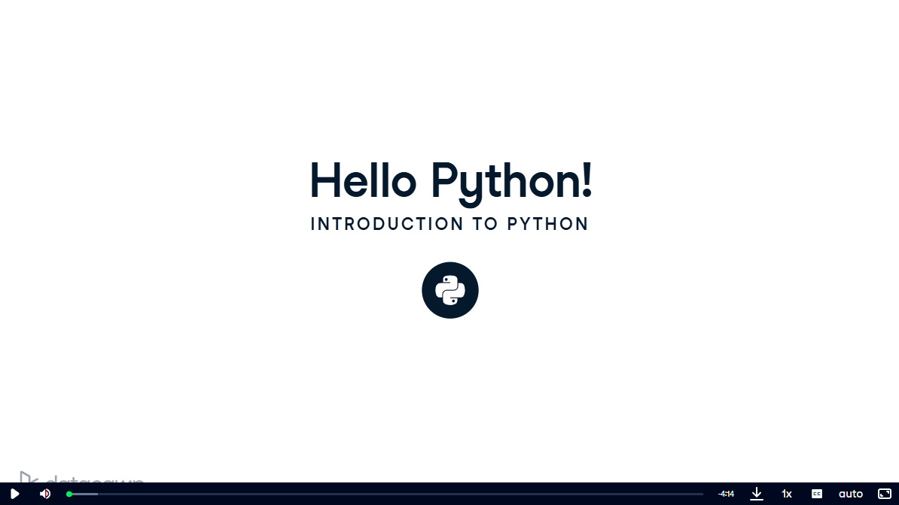
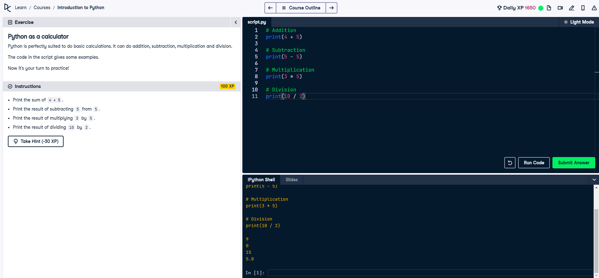
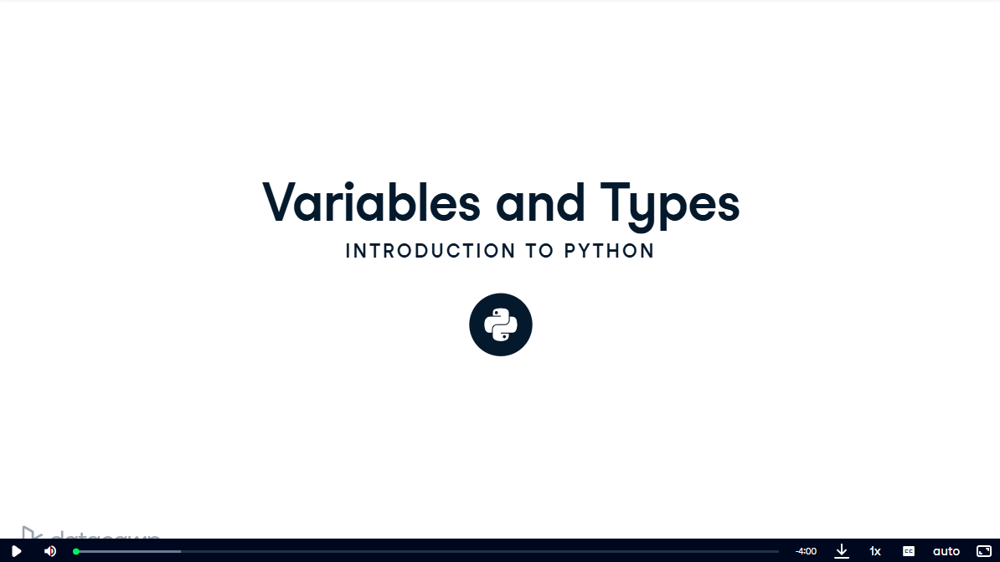
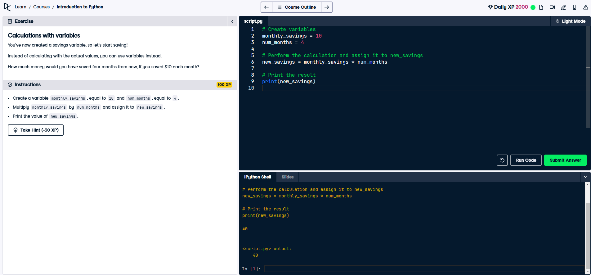
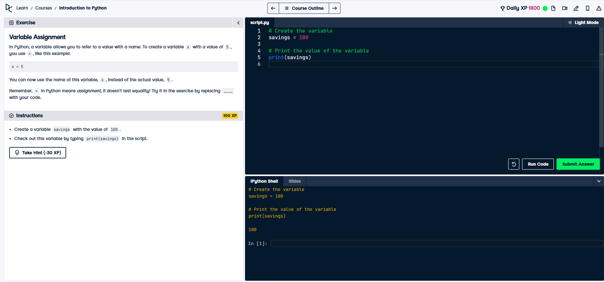
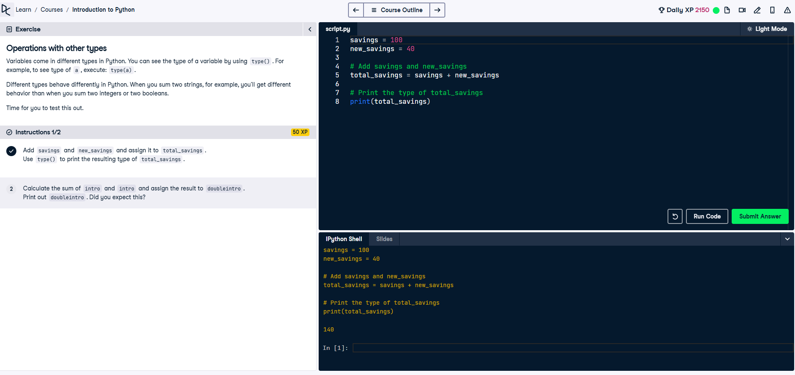
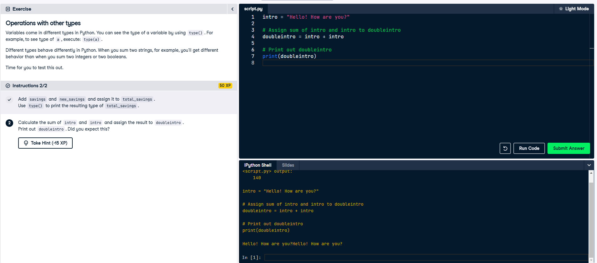
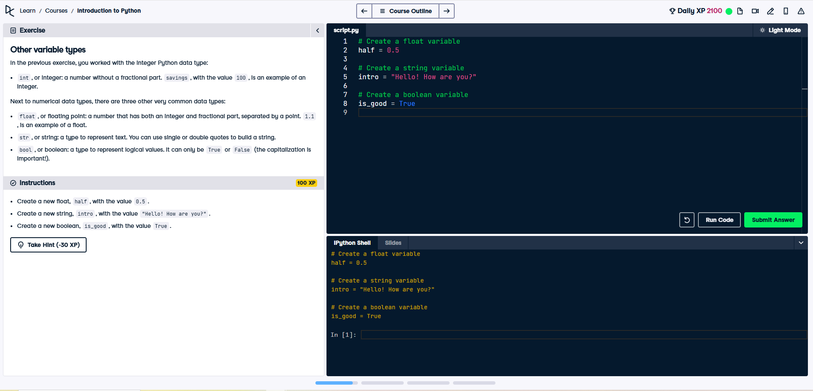
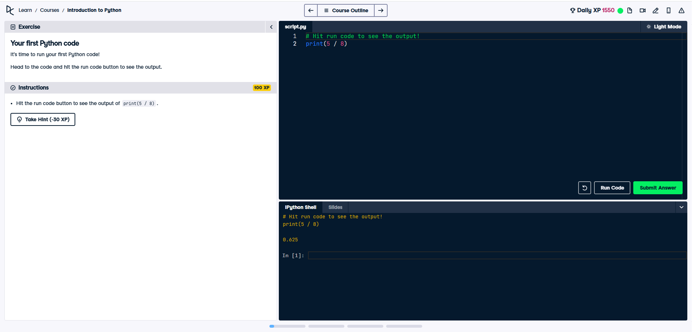

# Python Basics - DataCamp Course

## Overview

This course provided an introduction to the foundational concepts of Python programming, focusing on using Python interactively and through scripting. It aimed to equip learners with the skills needed to manipulate data, perform calculations, and build efficient, reusable code for data science applications.

---

## What I Accomplished

By completing this course, I achieved the following milestones:

1. **Understanding Python Basics**
   - Learned how to use Python interactively in the shell and through scripts.
   - Gained familiarity with using Python as a calculator to perform basic mathematical operations.
   
   

2. **Working with Variables**
   - Learned how to assign, manipulate, and utilize variables effectively.
   - Understood the different Python data types, including integers (`int`), floating-point numbers (`float`), strings (`str`), and booleans (`bool`).
   
   

3. **Data Manipulation and Operations**
   - Explored how to perform operations with variables of different types.
   - Practiced combining variables and understanding how Python handles different data types (e.g., adding numbers versus concatenating strings).
   
   

4. **Reusable Code**
   - Learned the importance of reproducibility by using Python scripts instead of typing commands interactively.
   - Understood how to modify variables within scripts and rerun code efficiently.
   
   

5. **Operations with Other Types**
   - Practiced operations on different data types and observed how Python handles them.
   
   
   

6. **Other Variable Types**
   - Gained an understanding of strings and booleans.
   
   

---

## Course Structure

The course was divided into the following sections:

1. **Hello Python!**
   - Introduced Python and its capabilities.
2. **Your First Python Code**
   - Practiced running Python code interactively and through scripts.
   
   

3. **Python as a Calculator**
   - Used Python for mathematical operations.
4. **Variables and Types**
   - Explored how to create and use variables to store data.
5. **Variable Assignment**
   - Learned how to assign values to variables and reuse them in calculations.
6. **Calculations with Variables**
   - Performed arithmetic operations using variables and stored the results.
7. **Other Variable Types**
   - Gained an understanding of strings and booleans.
8. **Operations with Other Types**
   - Practiced operations on different data types and observed how Python handles them.

---

## Why I Took This Course

I took this course to build a solid foundation in Python programming for data science. Understanding how to efficiently manipulate data, assign variables, and use Python interactively is crucial for advancing my skills in data engineering and analytics. The knowledge gained here will help me write reusable, scalable code and prepare for more advanced data-focused projects and roles.

---

## Next Steps

With the completion of this course, I am well-prepared to take on more advanced Python topics, such as data manipulation with libraries like Pandas and NumPy, data visualization, and eventually building data pipelines in my journey to becoming a Robotics Systems Analyst.

